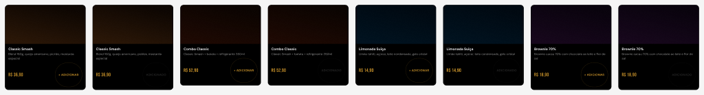

# Bug 02 — Frame-filho fica 100×100 (default trap do `createFrame`)

## Sintoma
Componente fica visualmente desproporcional. No caso do Menu item card cliente v1.6, o "Add button" — que deveria ser um pill ~110×34 — apareceu como bloco quadrado 110×100 amarelo, inflando os 8 variants do Menu item card por ~106px cada.

**Antes (bug):**



**Depois (fix):**


## Causa raiz
`figma.createFrame()` retorna um frame com defaults:
- `width: 100`, `height: 100`
- `layoutSizingHorizontal: "FIXED"`, `layoutSizingVertical: "FIXED"`

Quando você adiciona esse frame como filho de um auto-layout HORIZONTAL/VERTICAL **sem** explicitamente setar `layoutSizingHorizontal/Vertical`, ele mantém FIXED 100×100 — mesmo que o conteúdo interno seja muito menor.

A "intuição" de que `figma.createFrame()` + auto-layout = HUG automaticamente é falsa.

## Fix
**Sempre** setar `layoutSizingHorizontal` e `layoutSizingVertical` em todo frame-filho de auto-layout, **após** o `appendChild`:

```js
const addBtn = figma.createFrame();
addBtn.name = "Add button";
addBtn.layoutMode = "HORIZONTAL";
addBtn.paddingTop = 11; addBtn.paddingBottom = 11;
addBtn.paddingLeft = 14; addBtn.paddingRight = 14;
addBtn.itemSpacing = 4;
addBtn.primaryAxisAlignItems = "CENTER";
addBtn.counterAxisAlignItems = "CENTER";
// ... fills, strokes, radius
footer.appendChild(addBtn);
addBtn.layoutSizingHorizontal = "HUG";  // ← OBRIGATÓRIO
addBtn.layoutSizingVertical   = "HUG";  // ← OBRIGATÓRIO
```

## Por que `primaryAxisSizingMode/counterAxisSizingMode` não basta
Para o frame raiz (variant), `primaryAxisSizingMode = "AUTO"` funciona porque o variant é o root da árvore de auto-layout. Mas para frames-filho dentro de outro auto-layout, `layoutSizingHorizontal/Vertical` é a API correta — ela considera o eixo do parent, enquanto `primaryAxisSizingMode` se refere ao eixo próprio do frame.

Tabela mental:
- Root frame (variant): use `primaryAxisSizingMode/counterAxisSizingMode`
- Frame-filho de auto-layout: use `layoutSizingHorizontal/Vertical`

## Detecção via audit
Após criar/editar componentes, audit script que percorre a árvore e flagra qualquer frame com `width === 100 && height === 100` é uma boa heurística — quase certeza de ser este bug. Veja `references/audit-scripts.js > findSuspiciousDefaults`.

## Referência cruzada
- Detectado pelo usuário no nó `236:27` (Menu item card variant `Category=Combo, Added=False > Footer > Add button`).
- Fix aplicado em todos os 8 variants do `198:307 Menu item card`. Heights caíram de 331/349 para 265/283.
